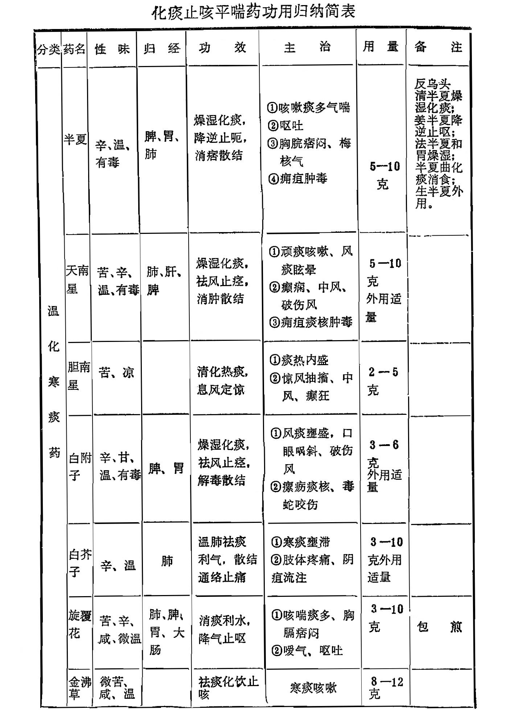
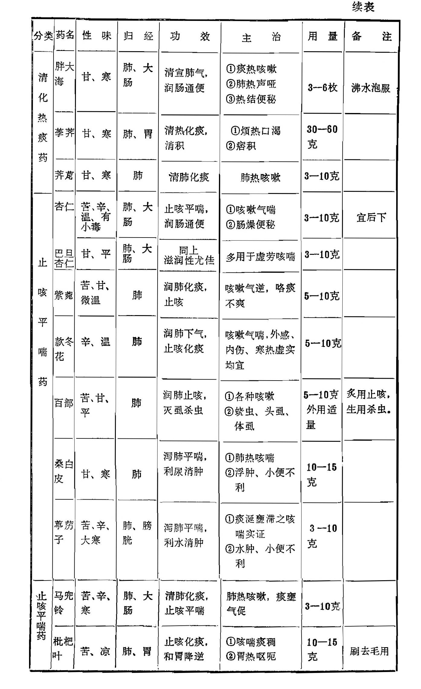

## 小 结

本类药物根据其性味与功效的不同，分为温化寒痰、清化热痰和止咳平喘三种：

一、温化寒痰药：本类药性多温燥，主要用于寒痰、湿痰所致之证。但临床应用也各有不同，其中半夏、 南星性均燥烈有毒， 都能燥湿化痰，外敷均有消肿止痛之功，然半夏长于祛脾胃之湿痰，又为降逆止呕之要药，可消痞散结；南星善祛经络之风痰， 并能解痉，南星用胆汁制后为胆南星，性凉而无燥烈伤阴之弊，功能清热化痰，息风定惊，可治痰热惊风抽搐之证。白附子亦为燥烈有毒之品，性偏升散，善祛风痰，为治风痰弓引起头面诸证的常 用药。白芥子辛温气锐，其性走散，既能祛寒痰壅滞于肺络，以治肺寒咳喘，又能祛寒饮留滞于胸膈，以治胸满胁痛，并搜皮里膜外筋骨间凝聚之痰，以治流注阴疽等证。旋覆花降气消痰，又善止噫，既治咳喘痰多，又治呕吐噫气；金佛草与旋覆花近似， 袪痰化饮作用略强。白前袪痰止咳，并能降气，专治肺气壅实， 痰多咳喘之证。皂荚有较強的袪痰作用，又有开窍之功，用于卒然昏厥，不省人事以及癫痫痰盛，外用有散结消肿之功，治疮肿未溃者。 

二、清化热痰药：此类药偏寒凉，主用于热痰或阴虚燥咳， 以及由痰热所引起的癫狂惊癣、瘿瘤、瘰疬等证。其中前胡清热化痰之中善能宣散风热，故为外感咳嗽所常用。桔梗长于宣通上焦，开提肺气，有良好的宣肺祛痰、排脓消痈之功，故多用于外邪犯肺，肺气不宣之咳嗽、咯痰不利、咽痛、音哑以及肺痛咳吐脓血等证。贝母为清热润肺化痰之佳品，主治痰热咳嗽、阴虚燥咳、劳嗽咯血等证，并兼能散结消肿，故常用于痈肿瘰疬之证， 贝母又有川贝、浙贝之分，川贝长于润肺化痰，宜于阴虚肺燥之虚证；浙贝偏于清热化痰，散结力强，宜于风热或痰火郁结之实证；土贝母为另一类植物，只用于外料疮疡肿毒。瓜蒌性偏寒滑， 清润之力较大，除清热化痰外，又长于宽胸散结、润肠通便，故多用于痰热咳嗽、胸痹、结胸、肠便秘之证，临床应用又有皮、仁及全用之分。瓜蒌皮偏于清热化痰，宽胸利气；瓜蒌仁偏于润肺化痰，润肠通便；全瓜蒌则兼皮、仁的功效。竹茹善于清胃止呕；竹沥性较寒滑，善透经络之痰，以治痰阻经络，中风口噤诸证。天竹黄善于清心定惊，并能豁痰开窍，然性较缓和，故小儿惊痫方中多用之。礞石长于堕痰镇惊，主用于惊痫癫狂、顽痰内结之证。浮海石、海蛤壳、海藻、昆布均以化痰软坚为主要功效，但浮海石、海蛤壳多用于痰热咳嗽、咯痰不利之证；海藻、 昆布主用于瘿瘤瘰疬、肝脾肿大。瓦愣子专消顽痰坚结，又善制酸止痛。胖大海有清宣肺气之功，多用于肺热声哑、痰热咳嗽，既可入复方应用，又能单用代茶，还有清肠通便之效。荸荠有清热化痰消积之功。荠苨为清肺、化痰、解毒之品。	

三、止咳平喘药：本类药除止咳外，还能平喘，用治咳嗽喘息之证，临床上可根据病情选择使用。其中杏仁又有苦甜之分， 苦杏仁苦温润肺，止咳平喘之中兼有宣散之功，故常用于外邪犯肺，肺气不降之喘咳痰多之证；甜杏仁甘平润肺，多用于肺虛劳嗽，但润肠通便之功，两者是相同的。紫苑、款冬花、百部均为润而不燥之品，都能润肺止咳，无论新久寒热虚实咳嗽皆可应用， 然紫菀化痰力胜，冬花、百部止咳功强，且百部又能杀虫灭虱。 桑白皮性寒而沉降，消肿力强，能行水而消痰，利水而消肿；此外，近代研究尚有一定的降压作用，可用于治高血压病。葶苈子寒降之性较大，长于泻肺行水，祛痰定喘，宜于痰饮喘咳，水肿胀满之实证。马兜铃止咳平喘之中善能清肺降气，宜用于肺热咳喘。枇杷叶化痰止咳之中又长于降逆止呕，以治气逆呕哕之证。	

复习思考题

1、试述化痰止咳平喘药的定义，怎样掌握运用化痰止咳平喘药？

2、根据化痰平喘药的各自效用特点可分为几类，各适用于哪些证候？

3、分析比较下列药组的效用异同：半夏与南星  桔梗与前胡  贝母与瓜蒌  桑白皮与葶苈子  紫菀与款冬  白附子与白芥子
