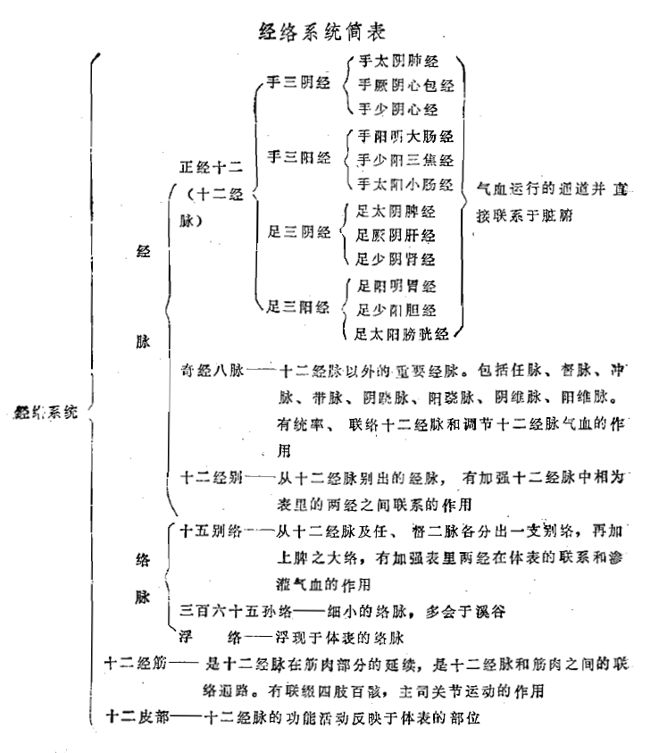

## 第一节 经络与经络系统的组成*

### 一、经络

经，有路径的含义；络，有网络的意思。经络是运行全身气血，联系人体各部分的通道。狭义的经络是经脉和络脉的合称，是组成经络系统的主体。经脉大多循行于人体的深部，隐而不见，故称为里（《灵枢·经脉》：“经脉为里”）。络脉大多行于人体表浅部位，有的明显可见。“支而横者为络”（《灵枢·络脉》）。广义的经络，即指整个经络系统而言。人体就是依靠经络系统将身体内外各局部联系成为一个有机的统一整体。

### 二、经络系统的组成

经络系统是由经脉（十二经脉和奇经八脉）、十二经别、络脉（十五别络、三百六十五孙络）、十二经筋、十二皮部所组成。

经脉  经脉分为正经和奇经两大类。正经即十二经脉，有手足三阴经和手足三阳经，是全身气血运行的主要通道，并直接与五脏六腑相连属。奇经有八，即督脉、任脉、冲脉、带脉、阴跷、阳跷、阴维、阳维，合称“奇经八脉”，有统率、联络十二经脉和调节十二经脉气血盈亏的作用（“人之气血常行于十二经脉，其诸经满溢则流入奇经焉”《圣济总录·针灸门》）。可见，所谓称为奇经，是因为它有异于十二正经。十二正经均有表里相合之经，而奇经没有相合之表里经脉。十二经别是从十二经脉别出的经脉，分别起自四肢，循行于胸腹深部，再上出于颈项浅部；阳经的经别从本经别出后，由体内仍归于本经；阴经的经别从本经别出，行于体内后，与相表里的阳经相合。十二经别的作用是弥补十二经脉未达到的器官、部位，加强十二经脉表里两经之间的联系。

络脉是经脉的细小分支，分为十五别络、浮络、孙络。十五别络是较大和主要的络脉。它的主要作用是加强互为表里两经之间在体表的联系。浮络是浮现与体表的络脉。孙络是最细小的络脉的分支（《灵枢·经脉》：“络之别者为孙”），它遍布于全身。孙络的作用不仅可使营卫气血通行于体表，且为邪气出入之通路，因而有卫护作用。

经筋是十二经脉与筋肉之间的联络通路，是十二经脉在筋肉部分的延续。经筋有联缀四肢百骸，主司关节屈伸的作用。

皮部是十二经脉的功能活动在体表的反映部位，又称十二皮部。

