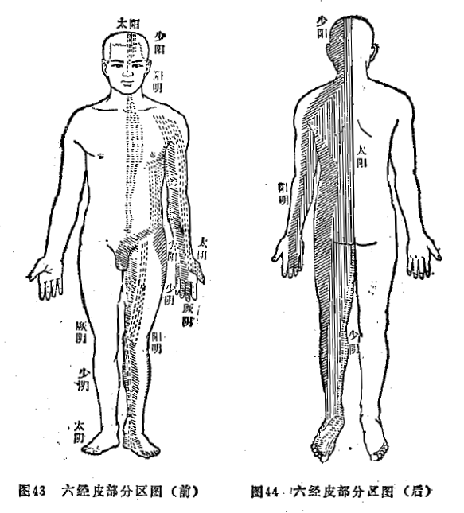

## 第七节  皮部

皮部是十二经脉系统分布于体表的部分，简单地说，皮部就是十二经脉系统的皮表部，也是十二经脉系统最外围的部分。《素问·皮部论》说：“皮者，脉之部也”。就是说十二经脉及其络脉，在皮表各有相应分布区域。由于经脉有十二，全身皮表就有十二个相应的区域，称十二皮部。所以，《素问•皮部论》说：“欲知皮部，以经脉为纪”。关于十二皮部在体表的部位，尚未见到古代文献的明确记载。现转引《中医基础理论详解》一书中示意图做为参考。（图43、44）

### 一、十二皮部在生理病理上的意义

（1）防御外邪  外邪侵犯人体，首先经过皮毛，而后是络脉、经脉，直至腑脏。所以，十二经皮表之部——十二皮部，就成了防御外邪的第一道屏障。如果皮部功能（卫气）衰弱，邪气就易于侵犯皮部，并进而深入经脉、脏腑而发病。所以，《素问·皮部论》说：“皮者有分部，不与而生大病也”。“不与”即“不用”，即皮部功能失常，防卫机能减退，邪气就易于侵入。又如：“汗出当风”是皮部卫外不固，风邪乘虚而入。

（2）脏腑经络气血盛衰反映于皮表的通道  中医学认为，“有诸内，必形诸外”，是说内在脏腑的生理病理变化，必在外表有所反映。而这种反映是通过什么途径实现的呢？这一途径之中，就包括经脉所属的皮部。皮部是经络系统最外围的达于体表的部分。这样，脏腑就通过经脉、络脉，以及皮部，使体表和脏腑之间建立了直接联系。所以，脏腑气化活动及其精气盛衰变化，就可通过十二经脉、皮部反映于体表。因此，可以从人体外表的变化（如望面、望舌及体表寒热等），揣知脏腑的功能状况。如《灵枢•经脉》说：足阳明胃经“气盛则身以前皆热”，“气不足则身以前皆寒慄”。因为足阳明胃经经脉行于身前，其皮部在身即在身前皮表。又如《素问·刺热篇》说：“脾热病者鼻先赤”，“肾热病者颐先赤”等等。这些都是脏腑、经络病变在体表皮部的反映。由此可知，中医学的“藏”与“象”的必然联系，“有诸内，必形诸外”，以及“以外知内”等等观点和原则，是有其经络系统的实在依据的。

（3）充养皮毛  脏腑精气通过经脉而至于皮部，从而达到营养皮毛的作用。所以，皮毛的润泽与枯槁，皮毛的生长状态，亦间接地反映了脏腑精气的盛衰。

### 二、十二皮部在治疗上的意义

十二皮部的存在，及其与经络、脏腑的联系，是某些外治法的依据。外治法是在皮表施以药物或针刺（毛刺等）、按摩等达到治疗局部或体内脏腑病变的目的。如薰、洗、浴、敷贴等外治法，就是将药物直接作用于皮表，通过皮部、经络而使药力达于病所。外治法，已广泛地应用于临床各科，成为中医临床治疗的重要方法之一。
