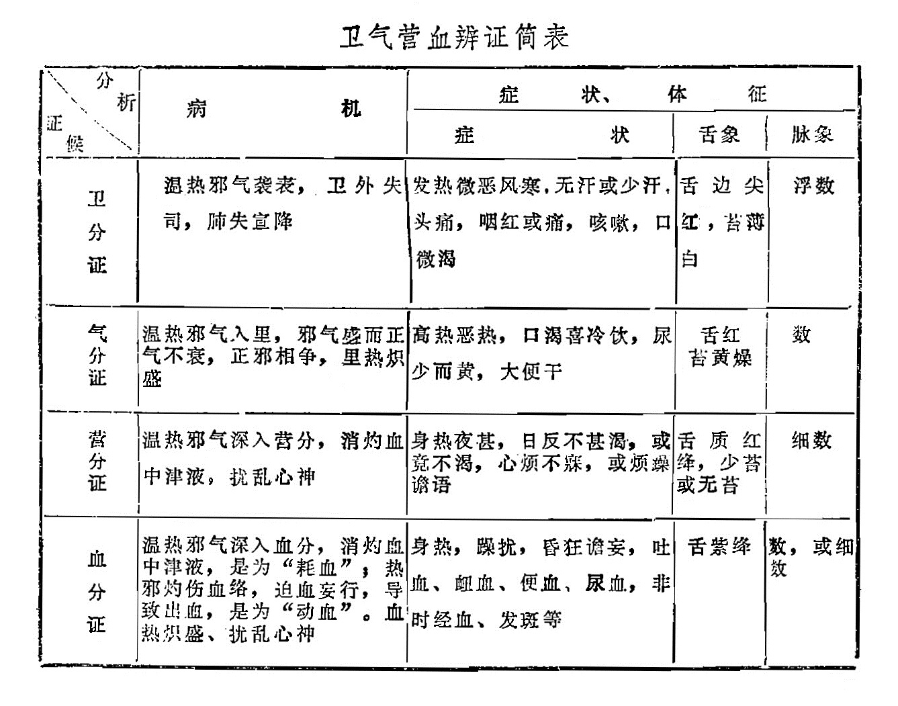

## 第五节  卫气营血辨证

卫气营血辨证，是外感温热病的一种辨证方法。是在伤寒六经辨证基础上发展起来的。它按照温热邪气侵袭人体致病的发展规律及其发展过程中各阶段的病变特点，将其分为四类病证，并依此来标示它们之间的传变规律。卫分证与气分证是功能障碍的病变；营分证与血分证是物质损伤的病变。而卫气与营血之间，又有浅深轻重的区别。卫分证主表，它是温热邪气袭表，导致卫外功能障碍的病变，其病变部位在肺与皮毛。邪气进一步发展，则入气分，导致脏腑功能障碍。一般来说，这一阶段邪气盛而正气不衰，正邪相争激烈，呈现一派里热炽盛的特点。气分证由于邪气侵袭的部位不同，可出现胸膈、肺、胃、大、小肠、肝、胆等脏腑的证候。若湿热邪气深入营血，或心包，消灼血中津液，则为营分证。若湿热邪气深入心、肝、肾，损伤肝血肾精，耗血动血，则为血分证。“分”即分界之意，其引申意为“阶段”。也就是说，卫气营血“四分”，实际上就代表了温热病的浅深轻重四个不同阶段。

关于温热病的传变规律，就一般情况而言，是沿卫→气→营→血的顺序渐次深入。但由于邪气的种类与感邪轻重程度的差别，以及患者体质的不同等因素，临床中亦有病变初起即不经卫分而迳见气分证或营分证者；还有卫分证与气分证同时出现的“卫气同病”；或气分证与营分证、血分证同时出现的“气营两燔、气血两燔”证；又有卫分证不经气分而直入营分的“逆传心包”证等。

温热病的特点就是热邪伤津，所以治疗上始终要以泄热保津为重点。卫分、气分重在清泄热邪，泄热即可以保津；营分、血分在清热凉血的同时，又要养阴生津。

因为卫气营血辨证的内容将在《温病条辨讲解》中详细讲述，本节仅列简表概括介绍如下：

 **卫气营血辨证简表** 

| 证候       | 病机                                                         | 症状                                                         | 舌象                 | 脉象       |
| ------ | ------------------------------------------------------------ | ------------------------------------------------------------ | -------------------- | ---------- |
| 卫分证 | 温热邪气袭表，卫外失司，肺失宣降                             | 发热微恶风寒，无汗或少汗，头痛，咽红或痛，咳嗽，口微渴       | 舌边尖红，苔薄白     | 浮数       |
| 气分证 | 温热邪气入里，邪气盛而正气不衰，正邪相争，里热炽盛           | 高热恶热，口渴喜冷饮，尿少而黄，大便干                       | 舌红苔黄燥           | 数         |
| 营分证 | 温热邪气深入营分，消灼血中津液，扰乱心神                     | 身热夜甚，日反不甚渴，或竟不渴，心烦不寐，或烦躁谵语         | 舌质红绛，少苔或无苔 | 细数       |
| 血分证 | 温热邪气深入血分，消灼血中津液，是为“耗血”；热邪灼伤血络，迫血妄行，导致出血，是为“动血”。血热炽盛、扰乱心神 | 身热，躁扰，昏狂谵妄，吐血、衄血、便血、尿血，非时经血、发斑等 | 舌紫绛               | 数，或细数 |