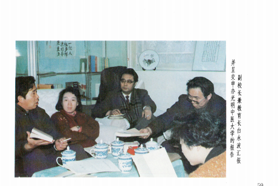

# 光明中医函授大学第二次分校会议总结报告

---光明中医函授大学副校长兼教育长白永波

各位领导、同志们：四天紧张的会议结束了，我代表校长办公会议作会议的总结。

一、本次会议所做的工作

这次会议办了五件事情：

1、名誉校长李德生同志召集了一个座谈会，参加座谈会的是光明中医函大一些主要领导机关的负责同志，其中有《光明日报》社顾问、前总编杨西光、《光明日报》社秘书长卢云、《中国教育报》副主编杨建业、卫生部中医司司长田景福。原定由李德生同志约请的教育委员会常务副主任杨海波同志因事没有到会；原来接受参加这个座谈会的齐心同志、梁伯琦同志、卓琳同志临时有事，打来了电话，我们的名誉校长崔月犁部长因有部党组会议，所以也没能参加座谈会；总顾问江一真同志也打来了电话：总顾问童陆生同志参加了会议。这个座谈会的目的，是希望关心、支持和参与函大工作的一些老同志和领导机关能对函大给予实际的支持，并宣传和检查函大的工作。这个目的已经达到了。

　　

2、总结了前一段的工作。总结是由吕炳奎校长、王德嘉副校长以及在座的所有分校领导同志一起讨论的，肯定了一年来我们的成绩，找出了差距，明确了任务·大家一致认为：光明中医函大办学的方向对头，课程总体设计思想好，并得到了全国中医界特别是名老中医的支持。

但是，我们存在的差距也是不小的。比如在总校方面：学籍管理、教学组织的建设和教材的编写、印刷，都存在一些问题。

一年多来在和分校的联系工作中，总校的办事机构效率不高。会上，分校的同志对总校提出了批评意见，我们诚恳地接受。有些对总校的批评，也是总校在半年多来向主办单位（《光明日报》社）经常谈到的问题·我们真心实意地接受批评，也深感我们工作的差距之大，不管客观上出现什么情况，这种批评都是正确的，都是对函大工作的爱护。

3、明确了下一步从总校到分校都要做好注册、招生、考试的准备工作。这是近期任务，是三项实质性工作。

4、修改了文件。四个小组讨论文件的态度非常认真，可说是字斟句酌、严谨推敲，这是对函大事业高度负责的表现。修改的文件有招生、注册、学籍管理、发行、分校辅导站建设，考试、教学计划、杂志工作计划等十个文件。通过修改文件达到了采取措施、拿出办法、统一口径的目的。有些文件在执行之前还要进一步征求分校意见。

5、起草了两个给卫生部的报告。第一个报告的要点是：把光明中医函大作为卫生部中医成人教育的组成部分。这个报告是很重要的，关系到我们函大在整个中医自学考试中的位置。起草这个报告，在前一段时间是不具备成熟条件的。但从这次座谈会上卫生部田司长的态度；《光明日报》社、成人教育主管部门的态度：特别是名誉校长崔月犁同志的态度，使我们具备了打这个报告的可能性。我和王德嘉同志曾再三追向崔部长：我们函大和全国中医自学考试委员会如何协调？以及我们老校长提出的经费问题。崔部长说：“你们拿出个办法，先写个东西。”这就是说具备了起草这个报告的条件。第二个报告的要点是：学员参加自学高考要按照光明函大的专业课程、教材内容命题。这就实现了崔部长所说的“中医教育两条腿走路”的设想。

6、在会前及会议期间，我们用了半个多月时间，筹集了15万元的面授辅导费，相当于应该下发经费的三分之一（总数是45万元），要全部给分校，尽管有了这15万，也仅仅是解燃眉之急，还需要各个分校艰苦创业，坚持几个月。王德嘉校长一再讲：所差的分校面授辅导费费用如数下发，这一点请同志们放心。

总之，同志们反映，总校召开第二次分校校长会议是非常及时的，会议开的是成功的，解决了很多实际问题。这首先应该感激《光明日报》社、北京市成人教育局；感谢给予我们支持的各级政府、行政部门以及各民主党派；也应该感谢所有关心函大事业的同志们以及在座的所有分校领导同志。

二、收获和进展

这次会议的收获是多方面的，我主要对思想上的收获谈几点。

　　

1、鼓舞了斗志。

通过这次会议，许多老前辈、两位名誉校长、总校顾问和老校长的讲话，对我们大家是很大的教育，使我们能够认识到：振兴中医是振兴中华的组成部分，函大事业是振兴中医的组成部分。通过一年来办学的实践，证明了函大的办学方向是正确的，函大的成立是合法的，函大是由《光明日报》社牵头和支持，以全国中医专家为主体来创办的，并不断得到各级政府和各界人士的大力支持！李德生同志讲：“函大这件事，是件大好事，也是得人心的事！办事情必须从点到线，从线到面，逐渐发展起来。要想人民之所想，急人民之所急，能为人民办好事，就要发动群众把它办起来。群众欢迎的事情，就一定会办好的！”崔月犁同志的讲话贯穿了从战略上如何发展具有中国特色的卫生工作的指示精神。他在函大的讲话与今年年初在全国卫生厅局长会议上的讲话精神是一致的，就是说：中国的卫生事业，离开了八亿农民，就离开了社会主义道路！

中医司田司长在函大座谈会上说：“我们这个函大的培养月标，是临床中医人才，学员大量来自农村，学好后在当地为农村服务，这个方向非常正确，我们所到之处，大家找我们说：'学生学了四年，总要有个结果。对此我们都完全理解，光明中医函大办学方向、培养目标比较明确，有一套完整的教学制度、教学计划、管理办法。特别难得的是搞了那么多分校、面授辅导站，这符合中医的特点，中医自学考试不是没有考虑到函大，既然有这么一个雄厚的助学基础，我们把你们作为一个助学基础，纳入国家自学考试，“杨西光同志说：“这个学校有两个重要意义：一个是发展中医；一个是创造适合中医特点的、科学的中医教育的方式。这一点，意义很大，这是我国教育的一个新事物。从来我们把民族文化作为中心，要求发展教育事业，教育部门应该给予承认。我们有这个基础，为什么不给予承认呢？我想不通，哪怕给予初步承认、有些条件下的承认也可以。《光明日报》社给予服务是没问题的，你们要我们办什么事，我们办，”这就是主办单位的态度，是主办单位对函大事业意义的认识。

通过讨论和学习，我们认识到：函大所走的道路，是一条拾遗补缺的改革之路，函授教育，制定方针、方向、办法，交分校和辅导站两级执行，这是从来没有过的；中医界办这么大的函授大学，也是从来没有过的；中医界能把几百名老中医、各省的中医界和社会力量动员起来，一起齐心协力地办一件事情，恐怕也是没有过的！我们创办的《光明中医》杂志，以及我们发起、协助创办的《中医骨伤科杂志》、《康复与疗养》杂志，都是过去没有的，由全国的骨伤科专家办起来的骨伤科函授学院，也是前所未有的，这些都是在短短的一年中，由光明中医函授大学扶植起了这些中医教育事业和中医学术事业。

从1956年建立正规中医学院起，全国从全日制院校、西学中班，中专，业余学习，全用1一5版教材，因而没有可比性，我们提出创办光明函大，建立自己的系列教材，这本身就是一个拾遗补缺，我们在进行教材建设和课程设置方面，不是主观主义的，我们是根据中医几干年来人才培养的历史经验和中医人才的知识结构以及三十几年来中医教育正反两方面的经验和世界医学教育改革中面临的趋势而决定的，所以应该理直气壮地说我们课程设置的知识结构是合理的，正确的，是二十世纪八十年代的中医正确处理了继承与发扬的关系，尽管我们的教材还很粗糙，还存在这样、那样局部上的缺点，但我们注意了“深入浅出“。当然，由于编写人员各方面修养的差异，有的好些，有的差些。**这些局部的缺陷并不能否定我们课程设置的合理性，关于课程设置曾征求17个省名老中医的意见，是有其基础与科学性的，从函大成立至今，一直未动摇过**。

2、增强了信心。

我们的信心来自上述认识和对整个中医业发展的宏观判断，目前，世界医学教育总的趋势，是培养的毕业生缺乏在基层保健服务的能力，这是世界性的“流行病“学科越分越细，实战能力越来越低，这就把医学院校培养人才的主要目的失掉了，据记者调查，我们中医院校的新生入学不是“自由恋爱“而是”父母包办”的占多数．就是分数达不到清华北大的标准，录取了第三志愿恰恰是他不愿意上的！所以有专业思想不巩固的问题，而且这个比例数是比较大的，想学中医的年轻同志进不来门，不想学的占领了课堂。所以专业思想不巩固，毕业后改行，防病治病能力下降。培养的产品和社会需要口径不对，这是不可否认的事实。

应用科学不仅仅是科学，同时也有工艺和艺术成份，我想中医就是这类型的科学，所以我们引导学员要务实求实。如果我们的系列教材设计，也是对自学中医的同志很大的帮助，从去年10月至今年5月，我们函大能顶住那么大的压力，说明我们的基础是牢固的。七个多月的时间里，很多同志在默默地尽义务，如河南的张海岑老；年轻一代如浙江毛水泉同志等。几位老校长、老领导给了我们很大力量，八十多岁的童老一再嘱咐我们顶住困难，克服困难；一顶，一咬牙，困难就过去了。在我们最困难的时候，李德生名誉校长和江一真总顾问都打来电话，鼓励我们要坚持住，加强管理，不要出问题。

所有这些，都是我们力量的源泉。

另外，从总校到分校参加办学的同志，不谋私利，义务或半义务办学，把知识和力量奉献给祖国和民族。“心底无私天地宽“，如果办事业时患得患失，肯定要前怕狼后怕虎。

所以，我们说增强了信心，信心就来自这几方面。

3、明确了方向。

明确了函大确定的“培养临床中医师“的目标是正确的。许多名老中医和卫生部田司长都肯定了这一点。这一点很重要，我们不是培养别的中医，是培养能看病的中医。只有能看病的中医师，才能消化、信任中医的理论。

明确了我们的课程设置和教材改革是函大的生命，中医成才有两大要素：一是具备阅读，看懂中医历代文献的能力；二是长期坚持临床实践，没有别的捷径，中医学院的早期毕业生总结出，办中医教育要早临床、多临床、反复临床。”这是成功的经验，所以我们要坚持。

明确了光明中医函大是三级管理，以分校为主体。我们大学这么大，总校不可能管理太具体，同时我们在制定办法时，大的意见要一致，小的方面各分校要酌情而定。

明确了光明函大不是一期学习班，要长期办学，按总校领导的设想，积极创造条件，争取在北京成为一个实体，有正式的教育部门的户头，有正式的校舍和专职教员以及必要的教学设备。

明确了总校要在现有的基础上积极创造条件，逐步改善各级办学人员的待遇，我们目前是低报酬，而且主要表现在教材编写与面授辅导两方面。很多管理人员是半义务或全义务的，在我们困难的阶段是可以的，但是长期办下去，各级管理人员都要有相应的报酬，我们要向这个方向努力。

4、坚持了改革。

“关于中医专业自学高考的答记者问”（规定以五版教材为蓝本）对我们的冲击很大。各校的同志采取了些措施，稳住了阵脚。这次会议后，通过向卫生部汇报，争取按我校的教材和进度来考我们的学员，不然我们的大学就无法办了。各省自学高考的课程进度不一样，而我校进度是统一的，这样各分校难以组织教学，如不按我校的教材考，学员学这套教材的意义就不大了，我们办函大的意义也不大了。所以，坚持我们函大作为一个自学考试的整体，也不能用别的本子来考我们。希望总校、分校辅导站要口径一致，成人教育局对此的意见是趋向于政治待遇相同，就是说除了不拿教育经费外，其他的待遇应相同，这个改革要坚持。

5、找出了解决困难的办法

主办单位《光明日报》社愿意出面与卫生部联系，卫生部也希望看到我们这次会议的纪要和文字报告，也就是说：有了找出路的可能性。同时按照田司长的要求，我们函大分两步走：第一步，社会助学，参加成人自学高考；第二步，创造条件争取国家承认本校毕业生的学历。田司长说：“你们反映，我们从中医司的角度也反映。”这个态度是非常积极的。

6、拿出了办法，改善了管理。

这个办法，就是我们具体形成文件的这套管理办法。特别是在加强分校、辅导站建设方面，从南宁会议到现在，各分校都见到了关于分校建设的几点意见。函大的教学工作如没有分校和辅导站，就是空的。所以希望分校和辅导站一起做好三方面工作

（1）做好与当地中医界、支持中医工作的社会各界的团结工作。团结工作非常重要，如果大家都为你说好话，就好办了。辅导站、分校办得好坏，就看你团结的人多少。

（2）把辅导站的工作落到实处，要有一个事业心强的站长，要让学员做函大的主人，他们有能力管理自己，我们要信任他们。

（3）辅导站的建设，关键是找一个可靠的办学人：作风正派，不谋私利，心胸要宽广，要能容纳些不同意见。总校领导委托的分校校长是经过慎重考虑的，我们是校长负责制，既选定了校长，就用而不疑。

7、统一了口径。

首先是统一了管理口径。如教学组织建设、学籍管理、教学计划、注册、招生、考试办法等。

统一了宣传口径。办学思想、教材建设和教学改革方向、函大的性质、任务以及函大学员的出路等。对外要按照统一的口径讲，否则会制造混乱。

总之，我们的收获可归纳为这样几句话：坚持办学，立足改革，探索前进，巩固提高。为办好光明中医函授大学；为培养中医后继人才；为振兴中医、为社会主义四化建设而努力！

三、会后的任务

这次会后，总校要做的几件事是：

1）.及时向《光明日报》社、国家教育委员会、卫生部、北京市成人教育局口头或书面汇报。

2）.整理会议纪要、领导讲话与有关文件，铅印下发。

3）.尽快办理注册，招生启事（要见报）

4）.积极做好86、85级教材的印刷准备工作

5）.办理《光明中医》杂志公开出版的手续。

6）.总校内部的办事机构从三方面进行建设，

（1）提高素质；

（2）适当增加专业管理人员；

（3）搞好函大总校专职工作人员的工资改革，免除这些同志的后顾之忧；

（4）筹建广东、韶关、福建、四川分校。

分校的主要任务是：

①、分校的同志回到当地后，要学习、消化、宣传、贯彻好这次会议的精神和领导的讲话。让参与分校和辅导站工作的同志都能了解领导讲话的精神。贯彻会议精神的情况，望各分校简报总校。

②、做好注册、招生、考试的各项准备工作。

③、在分校建设中，根据总校的经验：部队的离休干部，由于子女顶替退下来的干部，还有些年过花甲但精力非常充沛的离休干部，是民办的函大分校聘请专职工作人员的好对象。再配主几个年轻的学员，具休工作就可由他们做，这样可提高分校的工作效率。

下一年分校工作，要在务实上下功夫。

④、希望各分校的领导同志和领导班子要端正办学动机，每个分校的同志都要问问自己：“为谁辛苦为谁忙？”大部分同志的办学动机肯定与总校是一致的；少部分和我们在办学的具体作法上大同小异，这是客观存在，不可能完全一致，就怕动机背道而驰！如果确有办学动机和总校不同的，请提出报告，当然希望一个没有，校长办公会议下了决心：哪怕倒14所分校，光明中医函大也继续办！我们可以收缩---巩固---发展。

⑤、要在巩固现有辅导站的基础上向县城发展，根据为八亿农民服务的要求，我们光明中医函大要逐渐向农村发展，这是从十亿人的远大前途出发，而且中医在乡镇、县城这一级非常薄弱，现在这项工作在卫生部处于调研阶段，而我们做起来行动迅速，因我们已有了三级教育网，有基础，另外，总校已定了这一决策，分校再开个会就可以了，不用打报告，也不用各级批准，当然不能不顾条件一哄而起，那样反到影响函大的声誉。这方面辽源、锦州、秦皇岛的经验都很好。

函授重点向农村转移过程中要注意几个问题：一是对农村青年的文化水平的要求不能降低，如果降低要求，就培养不出合格的中医；二是农村学员比较分散，要考虑如何集中的问题，如果长期不能和学员见面，就不要招收；第三是辅导站的经费能否支撑分散的学员的辅导；第四是有没有专职人员，如果这些条件具备了，就可以进行工作；如没有条件，要先创造条件，不要搞一刀切，要根据条件。

⑥、要把函大办学的一套想法，转达给辅导站站长。

⑦、在保证教学质量有两个要素（实习问题暂不谈）：一是教材，一是师资，所以要筛选合格的师资，分校校长应深入教学第一线。选择师资的标准是有利于教学、有利于学员，不搞人际关系方法的标准，另外，可推广录音教学，一些难讲的课。可由分校来讲。学员听录音后，举行解惑答疑，这方法很好。

总校与分校之间，今后要加强信函联系。总校在信件函复工作方面过去漏洞不少，这样就不能起到表率作用。今后，这个工作要高度重视，各分校可将信函直接寄给总校各部门负责人（名单略），如不答复，可直接写信给王德嘉副校长。

最后谈一下杂志和图书发行问题：杂志准备升格为公开出版物，要求各分校推荐编委，从辅导站推荐通讯员。

我们函大的三级管理的函授网，是一个很好的中医图书发行网。我们将选择符合函大办学思想的图书，在函大系统内搞征订，解决学员看书难的问题。

四、几点希望

1、希望分校同志能够认真贯彻执行领导讲话的精神。

2、希望各分校把办学的积极性化为办学的实际行动。

3、希望总校、分校、辅导站三级管理机构同舟共济。我们有共同的认识、理想、信念和追求，这是我们团结的基础。

4、希望所有参与函大管理工作的同志能象国家女排一样，发扬拼搏精神。

5、希望我们在各级领导、社会各界的大力支持和主管部门的领导下，经过辛勤的劳动和不懈的努力，争取光明中医函授大学为振兴中医事业得到社会效益那一天的美好前景早日到来！

------

本文载于《光明中医》杂志1986年第二次校长会议特刊
