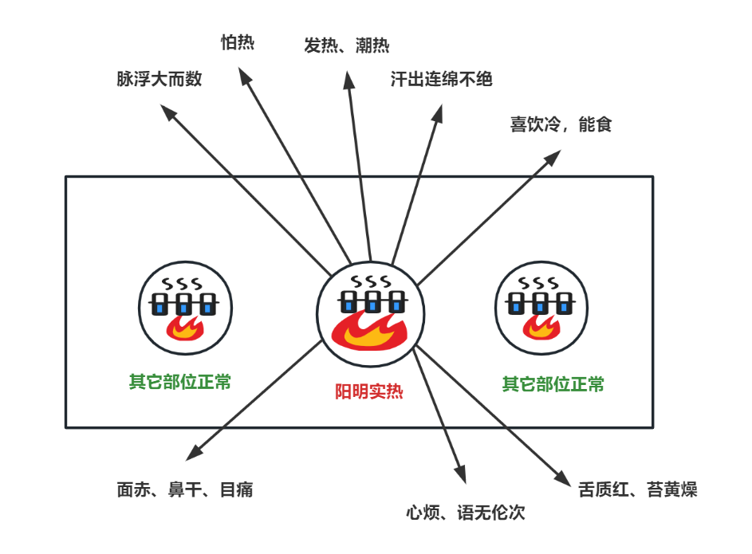
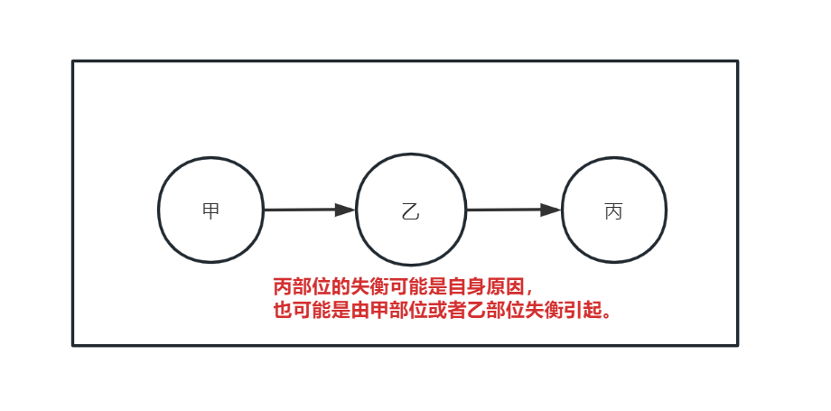

# 第七章 判断人体失衡情况

[TOC]

## 1、诊断基本原理 

前面介绍了人体的要素包括精、元气、神、气、血、津液、形等，这类要素的失衡就称之为证。判断要素失衡状态的过程称为辨证。中医辩证的原理主要包括以下两方面： 

1）有形与无形的关系

人体几种要素中，精、神、元气能量、气态物质属于肉眼不可见的要素，称为无形之物。血、津液、形体属于肉眼可见的有形之物。无形之物难以观察测量，有形之物易于观察测量。有形与无形的物质相互作用，可以通过有形之物的状态反推无形之物的状态。这个原理就像风吹旗子，风为无形的空气流动，其风力大小无法直接观察，但是我们可以根据旗子被风吹后的表现，来判断风力的大小。  

比如中医中的脉诊，就是通过感受动脉的跳动情况来了解气血的状态。原理是经络中的无形的气态物质推动有形的血脉跳动，因此血的运行状态可以体现气的运行状态。《桂本伤寒论》中说“脉乃气血先见”，即为此意。

> 脉乃气血先见，气血有盛衰，脏腑有偏胜。气血俱盛，脉阴阳俱盛；气血俱衰，脉阴阳俱衰。气独胜者，则脉强；血独盛者，则脉滑；气偏衰者，则脉微；血偏衰者，则脉涩；气血和者，则脉缓；气血平者，则脉平；气血乱者，则脉乱；气血脱者，则脉绝；阳迫气血，则脉数；阴阻气血，则脉迟；若感于邪，气血扰动，脉随变化，变化无穷，气血使之；病变百端，本原别之；欲知病源，当凭脉变；欲知病变，先揣其本，本之不齐，在人体躬，相体以诊，病无遁情。
> 
> 《桂本伤寒论•平脉法第一》

2）内与外的关系

人体内外有别，有形的物质虽然容易观察，但若隐藏在人体内部，则观察也是有难度的。但人是一个整体，内在的失衡必有外在的表现。如果掌握了内在失衡和外在表现的关系，就可以通过外在表现判断内在状态，这就是中医“有诸内，必形诸外”、“司外而揣内”的道理。

基于以上两点，搜集人体外在、有形的表现，来判断人体内在、无形的状态，判断精、神、元气、气态物质、血、津液等要素的平衡或者失衡，这就是中医诊断的道理。人体外在、有形的表现称为“**症**”，内在各要素的失衡称为“**证**”。在中医中，这两字同音但内涵不同。

> **证**，是机体在疾病发展过程中的某一阶段的病变部位、原因、性质，以及邪正关系的概括。因此，证是反映疾病发展过程中，某一阶段的**病变的本质**，所以它比**症状**对疾病的揭示更全面、更深刻、更正确。
>
> 《中医药学概论-辨证论治》

无论中医、西医，诊断的原则都是要把内在、无形而难以观察的要素状态，通过某种方法转化为可以方便观察的状态。科技界发明了很多检测工具，比如CT、核磁等。这些工具扩展了人的观测能力，可以在一定程度上更清晰的显示某些内在状态。从观察角度看，这是值得肯定的事情。中医也希望有某些设备，能够更准确、直接的显示神、元气、气态物质等要素的状态。但是因科技发展的局限，能达到中医要求的这类工具还没有实用化。现在医疗设备的检测结果对中医有一定参考价值，但对具体的辩证、用药指导性并不强。所以中医还只能使用“司外揣内”的方法，通过外在表现，来间接的判断其关注的要素状态。

## 2、诊断基本常识

中医收集人体外在表现有一套成熟的体系，即大家熟知的“望闻问切”四诊。这四诊概括了舌、脉、目、面、发、齿、唇、鼻、饮食、汗、大小便、寒热感受、体温、体型、体力、精神、行为、发音、呼吸、气味、睡眠等等方面的正常与异常表现。这些外在表现与内在要素的基本关系，就是中医诊断的基本常识。

这方面的内容比较多，这里只能介绍一些初步方法，从判断精、神、气、血的角度讲起。更详细的内容需要学习《概论》的四诊章节、《口诀》的四诊、《内经》的诊法、《伤寒论》的脉法等等。

### 2.1、判断神的状态

神藏于心，外候在目。

判断神的状态主要看双目。目光明亮、眼神灵活、目中润泽，目睛清莹，了了分明，此为神气充足。若是两目呆滞、目光晦暗、蒙混不清，是神气不足的表现。瞳仁散大，为肾精不足或将竭；瞳仁固定，为精绝神亡。

其次看神志是否清楚、反应是否灵活、说话是否有条理、发音是否清亮等等。

另外，注意是否是假神的情况。假神是指久病而重危的病人，突然精神转佳，言语不休，索饮索食，呼吸平匀，如同常人，这种假象，称为假神。假神往往是回光返照，很可能短时间即告死亡。

若神气充足，则人很少生病，生病也容易痊愈。反之，神气不足，则易病难愈，且容易得大病。

### 2.2、判断精的状态

精有先、后天之分。先天之精在肾，后天之精在脾。

肾的功能主生殖、主骨。

从生殖角度，当男子溢精和女子月经来潮的功能出现问题的时候，标志肾精不足。

从主骨角度看，齿为骨之余，肾主骨，精生髓。所以精开始不足的时候，先从牙齿上体现出来，松动掉落。进一步不足的时候，从骨骼上体现出来，老年人弯腰驼背、容易骨折。到比较严重的时候出现肩垂，项倾，腰折，膝败，脊骨突起的现象，称为大骨枯槁，表明肾精已经衰弱到相当严重，预后不良。

脾主消化吸收，主肌肉。

从消化吸收角度看，当人的饮食能力下降，标志脾精开始不足。

从肌肉角度看，当出现肌肉不结实、人中沟变浅缩短的情况，代表脾的能力下降。严重的出现臂、腿、臀等部位的肌肉失养、瘦削，称为大肉陷下，则代表脾精衰败。

> 骨为肾所主，肾为先天之本；肉为脾所主，脾为后天之本。如果人中沟深而长，面部肌肉高厚，轮廓方正，面部上、中、下三部耸起而不平陷，肌肉丰满，骨骼高起者，则提示先后天精气皆旺盛，所以人能长寿，活百岁而终其天年。
> 
> 《黄帝内经讲解-寿夭与先后天的关系》

### 2.3、判断气血的状态

中医判断气血的内容最多。这里简单介绍：面色、脉象、舌诊等几种方法的大概原则，算是索引，具体要参考教材诊断的内容。

#### 2.3.1、面色

面色包括面部的颜色和光泽。一般来说面色光泽明亮，为身体气血充足的表现，即使得病，问题也不大。

> 张三钖说：“五脏六腑之精华，上彰于明堂，……但当求其有神，虽困无害，神者色中光泽明亮是也，脉有胃气，同一理也。”
>
> 《黄帝内经讲解-色脉互参》

为什么面部的色泽能反应人体气血的状态呢？因为人体脏腑与经络相联，全身的经络都与面部相联。只有脏腑正气充足，功能强健，邪气很少，才能在面部体现出光泽明亮的状态。

> 十二经脉，三百六十五络，其血气皆上注于面而走空窍。
> 
> 《灵枢•邪气脏腑病形》

具体面部不同的部位与脏腑的关系，内容也比较多。《概论-诊法》不太详细，应该参看国医大师孙光荣主编的《口诀浅释》的望诊部分。

> 两眉之间，名为印堂，又称阙中，在面部中间的最高之处，是相关肺病的部位；印堂的上面，名为阙上，阙上到头发边缘，名为天庭，天庭处在整个面部最高最上的地方，是相关头面疾病的部位；阙上处在天庭和印堂之中，所以是相关头面及咽喉疾病的部位，印堂略向下，在两眼之间，名为山根，又称下极，是相关心病的部位......
> 
> [《口诀浅释》](https://www.gmzyjc.com/read/qs/qs01.md#_2)

#### 2.3.2、脉象

诊脉是通过人体一些部位的动脉跳动形态变化来判断人体内各种要素的失衡状态。

> 十二经脉循行部位上均有搏动应手之处。因此，可以在每一经的动脉处，测候该条经脉所络属脏腑的功能活动。例如，中部天，手太阴太渊穴，即寸口脉处,可诊候肺。中部人，手少阴神门穴处，可诊候心。下部天，足厥阴五里穴处，可诊候肝，女子取太冲穴。下部地，足少阴太溪穴处，可诊候肾。下部人，足太阴箕门穴处，可诊候脾，趺阳脉冲阳穴处可诊候胃。临证可在上述部位，测候所主脏腑精气的盛衰。
> 
> 《黄帝内经讲解-诊脉部位》

脉的跳动是一种波动，其频率、力度、长度、高度等等指标皆有特定意义。

力度：脉搏的力度应适中，若力度过小，称为虚脉，代表气不足；若力度过大，称为实脉，代表邪气过多而正气不虚，正邪对抗有力。

宽度：脉的宽度应该适中，若宽度过于窄小，甚至像线一样，称为细脉或小脉，代表血管中的血不足；若宽度过大，称为大脉，代表血管中的血偏多。

长度：脉搏每个波动与按脉手指接触的长度应适中，若长度较长，像琴弦一样，称为弦脉，代表肝胆气瘀滞，气不通则痛，所以常有痛症。若长度较短，像豆子一样，称为动脉，代表气血不通或者气血逆乱。

> 伤寒，**脉弦细**，头痛，发热者，属**少阳**。
> 
> 《伤寒论讲解-265条》

这里弦脉是一个容易误解的脉，因其解释为像琴弦，容易被误解为有力。其实弦脉就是长度较长，与力度无关。

> 春脉弦……其脉之来，**濡弱而长**，故曰弦。
> 
> 《难经•十五难》
> 
> 紧脉是言其有力，弦脉是言其**挺直的形象**。
> 
> 《口诀浅释-切诊》
> 
> 弦脉与紧脉似同而实异。**弦以象言**，紧则以力言。弦脉如弓弦，按之不移；紧脉则如转动的绳索，来往有力而不固定。
> 
> 《伤寒论讲解-辨脉法》

起伏：脉的起伏若过于流利，感觉圆滑，称为滑脉，代表气血涌动过快；若起伏艰涩、迟滞，如轻刀刮竹，代表气血不足。  

频率：脉搏正常频率应该是一呼一吸跳动四次，多于这个次数称之为数脉，代表有热；少于四次称为迟脉，代表有寒。

高度：脉的高低是指轻按为高，又叫浮取，离皮肤近；重按为低，又叫沉取，离骨近；不轻不重在两者之间为中取；正常情况下，无论浮、中、沉，脉搏的感觉应相差不大，代表气血分配较均匀。如果轻按的脉搏比重按的时候明显，称为浮脉，代表气血聚于表层。若重按的脉搏更明显，称为沉脉，代表气血聚集于里层。

以上力度、频率、高度、宽度、长度、起伏代表了脉搏的几大维度指标，每个指标都有其正常范围，超过正常范围则为失衡，向上失衡为阳，向下失衡为阴。所以《桂本伤寒论•平脉法第二》说“**凡脉大、浮、数、动、滑，此名阳也；凡脉沉、涩、迟、弦、微，此名阴也**”，其中浮、沉是从高度辨阴阳，滑、涩从起伏辨阴阳，数、迟从频率辨阴阳，动、弦从长度辨阴阳，大、微从宽度辨阴阳。

> **问曰：脉有阴阳，何谓也？**
> **答曰：凡脉大浮数动滑，此名阳也；脉沉涩弱弦微，此名阴也。凡阴病见阳脉者生，阳病见阴脉者死。**
>
> 《伤寒论•辨脉法》

这些指标排列组合可以形成非常多的组合脉象，有丰富的含义。比如脉数代表热，脉无力代表气虚，若两者兼有，数而无力，则代表气虚而热；若是数而有力则代表实热。其它各类组合，如浮大数、浮数、沉涩、细数等等各有其含义。组合脉象的数量远远超出后世所说的二十八脉。二十八脉只是常见病脉的总结，其中有些为组合脉，比如濡脉为浮、细、虚的组合，主有湿邪；芤脉为浮、大、虚的组合，主津血伤；革脉为芤脉浮、大、虚的基础上加弦的组合，主精血亏；。

> 此言者，非有六脉俱动也，谓浮、沉、长、短、滑、涩也。浮者阳也，滑者阳也，长者阳也；沉者阴也，短者阴也，涩者阴也。所谓一阴一阳者，谓脉来沉而滑也，一阴二阳者，谓脉来沉滑而长也，一阴三阳者，谓脉来浮滑而长，时一沉也；所谓一阳一阴者，谓脉来浮而涩也；一阳二阴者，谓脉来长而沉涩也；一阳三阴者，谓脉来沉涩而短，时一浮也。各以其经所在，名病顺逆也。
> 
> 《难经•四难》

总之脉象越接近正常波形，人越健康；远离正常波形，则不健康，严重的则代表死亡。中医中的各种绝脉，比如真脏脉、死脉、怪脉都是远离正常波形的脉象。理解脉的逻辑含义，能认识到脉象是按照不同维度的阴阳进行组合的道理，学习脉诊并不难。

各种脉象所代表的更多含义，参考教材的[《概论-切诊》](https://www.gmzyjc.com/read/gl/gl05-0.4.0.0.0.md)、[《口诀浅释-切诊》](https://www.gmzyjc.com/read/qs/qs01.md#_6)、[《伤寒论讲解-辨脉法》](https://www.gmzyjc.com/read/shl/shl01.01-1.2.0.0.0.md)大家应认真学习。

寸口脉是诊手腕肺经太渊穴的脉搏来诊断全身。因为“脉气始于胃，输于脾、但百脉朝会于肺，需赖肺气的推动才能灌注于五脏六腑”，所以各脏腑病变在寸口脉上都有体现。

> 寸口者，脉之大会，手太阴之脉动也。人一呼脉行三寸，一吸脉行三寸，呼吸定息，脉行六寸。人一日一夜，凡一万三千五百息，脉行五十度，周于身。漏水下百刻，营卫行阳二十五度，行阴亦二十五度，为一周也，故五十度复会于手太阴。寸口者，五脏六腑之所终始，故法取于寸口也。
> 
> 《难经•一难》

#### 2.3.3、舌象

舌象也是一种重要的诊断方法。舌象主要包括舌体与舌苔两部分，舌体就是舌的肉质部分，舌苔是舌头上的那一层苔。舌象可以反应人体的气血状态，舌体代表固液态的地气，舌苔代表天气。

体内的精、元气、血、津液等要素正常时，体现在舌象为：舌体颜色粉红、质地润泽、柔软灵活、无裂纹、厚薄适中、边缘光滑；舌苔颜色淡白、干湿适中、薄薄一层、全面覆盖舌体。

反之各要素有失衡时，在舌象上有对应变化，比如气热则舌苔黄、血热则舌体红、津血亏则有裂纹等等。

详见《[中医药学概论-望舌](https://www.gmzyjc.com/read/gl/gl05-0.1.4.0.0.md)》、《[口诀-舌诊新法](https://www.gmzyjc.com/read/kj/fjkj01.html#_3)》、《[口诀浅释-吴坤安察舌辨证歌](https://www.gmzyjc.com/read/qs/qs01_01.md#2)》

舌诊是一种简便的诊断方法，每个人都应该掌握。

#### 2.3.4、脉诊与色诊的区别

脉诊与色诊有一个区别在于脉象更能体现当前的身体能量状态，而面色更能体现较长时间的身体状态。年轻健康的人初得病的时候，一般不易发生面色的变化，而脉象上往往有体现。而老年久病之人，面色不好，经过调理后，可能脉象很快能见到好转，但是面色的好转要经过一个相对长的时间。

> 面部色泽变化是五脏精气盛衰的具体表现，一般情况下新病不易引起色泽的变化。所以如果面色失于荣润，都是病久伤及五脏精气的表现，所以为久病。所谓“脉不夺”，是相对“色夺”而言的，意谓久病面部色泽的异常变化较脉象的异常变化更为明显，所以不能理解为久病没有脉象的异常变化。
> 
> 《黄帝内经讲解-色脉互参》

### 2.4、小节

诊断总的原则是，无论望色、切脉、舌诊还是其它方面，我们都需要先知道正常人的情况是如何的，比如*正常的面色是怎样的*？*正常的脉象是怎样的*？*正常的舌象是怎样的*？然后才能知常达变，通过病人面色、脉象和舌象与正常情况的区别，来分析人体气血失衡的虚实，并施以补泻的调理方案。然后再根据调理后面色、脉象、舌象的变化，来确定调理方向是否正确。如此反复，最终将脉象、舌象调理到正常为止。

诊断知识是中医的基本功，需要系统学习，全面掌握。诊断知识不全，临证就会发生漏诊。明明**病人已经有某个明确外在表现表明内部的失衡情况，医者不知，必然不能正确辩证**，也就谈不上正确治疗。所以诊断基本功是否扎实，是专业人士和业余人士的关键区别。中医专业人士经过系统学习后，对人体的外在表现非常敏感，比如面色变化、寒热变化、声音变化、形体变化等等，会立刻联想到人体内部的气血精神问题，以及相应的方剂治法。而业余人士则没有这个能力，经常纠结于一些细枝末节症状，对关键表现却视而不见，自然无法进行系统的辩证分析，也无法给出解决办法。

## 3、诊断的思辨过程

掌握了诊断基本常识后，在具体辩证的时候要进行分析判断，具体思辨过程要注意以下两点：一为多角度判断，二为功能之间的逻辑关系。

### 3.1、多角度判断

中医的“司外揣内”是根据人的外在表现判断内部状态，简便易行。但是这种判断毕竟是外在间接判断，而不是直接看到到内在状态，因此，难免有一定误差。这就像我们通过汽车的故障灯判断发动机的故障，大多时候是正确的。但如果灯本身出了故障，发动机坏了而灯不亮，或者发动机没坏反而灯亮，这样就会出现误判。因此，尽量从多个角度进行判断。如果多个角度的外在表现都指向了某个部位的某种失衡，那么误判的可能性就要小多了。所以中医一直强调要尽量多的收集四诊信息，只凭脉，或者只凭舌象都是不够严谨的。

> 一脉所主非一病，一病所现非一脉，若不察外证，而凭脉用药，未有不误人性命者。因此，临证之时，仅凭脉诊，不及其余三诊的作法，是不利于临证的辨证论治的。
>
> 《中医内科学-中医内科学的学习方法》

比如对阳明部位实热的判断。阳明部位包含胃经、大肠经及相关胃腑和大肠腑，其功能是负责饮食的消化，所以阳气很足。实热的含义是该部位正气不虚，多出了无形的热邪。

判断这种情况的几个角度，从脉象看要有浮大而数；因里热外达，对外界寒热的感受应该是怕热，体温角度可能有发热或潮热，且发热不随汗出而减轻；汗的角度可能有大汗，汗出连绵不断，《伤寒论》称之为“汗出濈（jǐ）濈然”；因胃热，所以渴饮方面应该是口渴且喜欢喝冷饮，饮食方面应该是能食；从舌象看有舌质红而舌苔黄燥；因阳明经络通于面部而有面赤、鼻干、目痛；热邪过盛可导致心烦，严重可出现语无伦次、神识昏糊、狂躁不安（讝语）；体力方面应为有力；热邪严重，蒸发肠胃津液可能造成便秘。

如果一个人同时具有上面这些表现，就说明多个角度都指向是阳明热实的情况，辨为阳明实热证就比较有把握。如果只有一、两个表现，则要谨慎，再分析分析是否有其它可能。

人体的目、面、舌、脉搏及各种生理功能就像汽车的故障指示灯，能够表示出内在指标的各种问题。为了防止单一的指示灯故障，我们要收集尽量多的指示灯信息，进行综合判断。如果多个指示灯都指明是同一故障，才能比较准确的确定故障位置和性质。

有时还会出现不同的指示灯表达了相反的故障信息，这时要根据经验判断哪个指示灯表示的问题更准确，需要进行取舍，并在后继的调理过程中进行观察，判断取舍是否正确。这就是“舍脉从证”或者“舍证从脉”。

### 3.2、功能之间的逻辑关系

外在表现正常需要一系列内部器官协同工作，这些器官的功能构成了一种逻辑关系。若出现某种病症，则需要排查相关各个内部环节，寻找哪个环节出现了哪方面的问题，排查过程需要更多信息。比如家里的灯不亮，如果其它电器正常，就是灯本身的问题。如果其它电器也没电，那么就可能是家里的电路问题。如果邻居家也没电，那就可能小区变压器问题。如果通过这类排查确定了是小区变压器问题，这就是确定了病位。下一步还需要查看变压器是失火、受潮还是短路，这就是确定病性。确定了病位、病性才能给出解决办法。只有灯不亮这一个信息，是无法确定病位、病性的，必须结合其它信息。

人体的饮食、呼吸、睡眠、大小便、护卫肌表、精神、体力等功能都是如此，这些功能若正常，代表体内一系列器官工作协调。如果异常，则需要判断内部哪个位置的环境出现了何种问题。下面举几个例子说明：

1、怕冷：卫气负责护卫肌表，如果散布于皮肤表面的卫气不足，就会出现异常的怕冷。但是此时我们还无法判断原因在哪里。因为卫气产生于脏腑，传输于经络，通过肌表腠理散布于皮肤表面。其产生、传递、散布的过程中，任何一个环节有问题都可以导致表面卫气不足。这就需要更多的信息来帮助定位。

如果怕冷还兼有发热，因发热往往表明肌表的正气比较充足，说明这个怕冷不是因为内部产生的卫气不够，而是肌表的问题。反之，如果怕冷不兼发热，则很有可能是内部产生或传输到肌表的卫气不够。这就是《伤寒论》第7条“病有发热恶寒者，发于阳也；无热恶寒者，发于阴也”的含义。这里的“发于阳”指的是根本问题在肌表，“发于阴”指的是根本问题在内在的脏腑经络。

> 病有发热恶寒者，发于阳也；无热恶寒者，发于阴也⑴。发于阳，七日愈；发于阴，六日愈，以阳数七阴数六故也⑵。[7]...
>
> 注家对“发于阳”主要有三种说法，一是指太阳中风，中风初起即有发热恶风寒。二是指发于太阳，太阳病多是发热与恶寒并见。三是指发于阳经、发于三阳，是阳证，**凡以发热为主要特征的，都是阳气抗邪有力的反映，所以都属阳证**，是三阳经病。注家对“发于阴”也有三种说法。一是指太阳伤寒，太阳伤寒初起常以恶寒为著，而不见发热。二是指发于少阴、少阴病，阳气虚衰，故以无热畏寒为主要特征。三是指发于阴经，发于三阴，是阴证，**凡以恶寒为主而不发热的，多是阳气虚衰，抗邪无力的反映，所以都属阴证**，是三阴经病。此三说皆对临证有指导意义。
>
> 《伤寒论讲解-7条》

人出现怕冷有很多原因，这里以受风寒侵袭为例进行分析。人体感受风寒后正常表现应为正邪相争使身体发热，正气战胜邪气，通过自主出汗将邪气排出体外。汗后，身体恢复正常，各种异常症状消失。如果未能按此进程发展，则为病态，需要医药帮助。

受风寒之后，出现怕冷、发热的症状，说明是“发于阳”，即问题在肌表。此时要再看有汗、无汗。

如果有热无汗：此时无汗是皮肤汗孔腠理被寒邪闭合，卫气无法通过汗孔散布到皮肤表面，就会导致怕冷。卫气无法散布于外而郁集于皮下，所以可能发热比较重。严重的话，皮肤腠理闭合，影响肺气向肌表的宣发功能，可能会出现喘的现象。由此，恶寒、发热、无汗而喘这一组症状，就成为“寒邪闭表”的典型表现（此时脉象应为脉浮紧）。这里的病位为肌表，病性为寒邪实证，治法用麻黄汤。

> 太阳病，头痛、**发热**、身疼、腰痛、骨节疼痛、恶风，无汗而喘⑴者，麻黄汤主之⑵。[35]...
>
> 这八个症状，可归纳为发热，恶风寒，诸痛，和无汗而喘三组，“恶风”是“恶寒”的互词，这是寒邪伤阳，温煦失司所致。**发热**是寒邪闭表，**阳气被郁而不得发泄**所致。“头痛”是头项强痛的省文，“身疼”为全身肌肉疼痛，“骨节疼痛。为全身关节疼，“ 腰痛，即腰脊痛，由于寒主收引，寒主痛，寒邪袭表，使营血涩滞，筋脉拘紧，故见诸痛。其中头项、腰脊为太阳经脉所过，更能反映太阳经脉被寒邪所伤的特征，正如《灵枢·经脉》所说：“膀胱足太阳之脉……是动则病冲头痛，目似脱，项如拔，脊痛腰似折。” “无汗”乃因**寒邪闭敛毛窍所致**，是伤寒表实证最具特征性的表现。肺合皮毛，今表气闭郁，肺气不宣，故喘。“无汗而喘”既是两个并列的症状，也揭示了。无汗”和“喘”的因果关系，**无汗为表闭，表闭则肺气不宣，肺不宣乃生喘**。若与第〔3〕条合参，当脉阴阳俱紧，方属寒邪束表，卫闭营郁之证。
>
> 《伤寒论讲解-35条》

如果有热有汗：汗出而身体未恢复，不适症状仍在，这是不正常的，表明这个汗没有排邪，是病汗。有汗代表汗孔腠理没有被闭合，有热代表肌表正气并不衰弱。卫气并不缺少，且可以通过汗孔到达皮肤表层，所以怕冷不会那么厉害。营卫相协而行，营行脉中，卫行脉外。营血与卫气互相配合才能正常完成功能。如果两者配合不协调，可导致异常出汗，即营卫不合的病汗。如果这种营卫不合是肌表受风邪影响而产生的，就有恶风、发热、汗出的表现，用桂枝汤发微汗，调和营卫治疗。

> 太阳中风，阳浮而阴弱，阳浮者，**热自发**；阴弱者，**汗自出**⑴，啬啬**恶寒**，淅淅**恶风**，翕翕**发热**⑵，鼻鸣干呕⑶者，桂枝汤主之⑷。[12]...
>
> 太阳中风是**风邪袭表，营卫不和**，卫强营弱之证，治当解肌祛风，调和营卫，唯桂枝汤是至当之方，所以说“桂枝汤主之”。
>
> 《伤寒论讲解-12条》

> 病常自汗出者，此为荣气和，荣气和者，外不谐，以**卫气不共荣气谐和**故尔⑴。以荣行脉中，卫行脉外，复发其汗，荣卫和则愈，宜桂枝汤⑵。[53]...
>
> 但卫阳行脉外而固护营阴，营阴行脉中而滋助、制约卫阳，营与卫，内与外相合而不相离。今营行脉中，卫行脉外，相离而不相合，卫不固营，**营阴失护而外泄**，故用桂枝汤发汗以和营卫，使二者相合则自汗可止。
>
> 《伤寒论讲解-53条》

如果只怕冷，不发热，说明是“发于阴”，问题应在内在脏腑经络，再去寻找相关功能失常的表现协助判断。

以上是对相对健康的人感受风寒原理的粗略分析，主要是想说明中医根据功能逻辑关系判断病位的思路，即单纯一个怕冷的症状不足以判断病位病性，需要一组症状相互印证才能定位。对于原本就不太健康的人，比如原来就有阳虚、阴虚、湿气、内热等问题，则还有更多考虑，需要根据特定的表现进行辩证和治疗。像《伤寒论》346条的死证，发热、汗出不止伴随有下利（拉肚子）。有下利，说明里部阳不足，里部阳不足而表部有发热，说明表部这个热不是正气充足，而是阴盛格阳、孤阳外越。此时汗出不止，这个汗就不是正常的排邪外出，也不是营卫不和，而是营卫不足加虚阳外越，不能正常控制汗孔和营血。这种情况的关键在里部阴阳离绝，脏腑已经不能正常工作，是非常危险的。

> 伤寒六七日，不利，便**发热而利**，其人**汗出不止**者，**死**。有阴无阳故也。[346]...
>
> 今下利，发热同时并见，可知“发热”非为阳气来复，而是阴盛格阳，孤阳外越的假象。如果此时又见汗出不止，则是阳气外亡而营卫不固之象，终致有阴无阳，阴阳离绝，多难救治，故曰“死”。
>
> 《伤寒论讲解-346条》

2、便秘：大便是由大肠部位的食物糟粕和适度的水混合而成。如果出现干燥的情况，有多种可能，比如肠胃的热过多或者水不够等等。如果此症状同时伴有“口渴喜饮冷水”、“怕热”等表现，就比较符合阳明肠胃部位热实的证型。若没有这些表现，反而有“不太能吃饭”、“小便不顺畅”，且大便只是开始的时候干燥，后面又稀溏，那就比较符合阳明部位阳虚寒实的证型。此时是胃寒不能正确的消化吸收饮食（水谷不别），所以产生大便先干后溏的现象。其它还有气虚、血虚等原因形成的便秘，都是需要综合判断，具体可参考《中医内科学》的“便秘”章节。

> 阳明病，若中寒者，不能食，小便不利，手足濈然汗出，此欲作固瘕，必大便初鞕后溏；所以然者，以**胃中冷**，**水谷不别**故也。[191]
>
> 《伤寒论-191条》

3、阴虚：笔者曾治疗一个哮喘儿童。该儿童不发作时与常人无异，在春秋两季、劳累或饮食不节时易发作。发作时具体表现为：从下午开始，咳喘逐渐严重，呼吸有哮音，自觉有热，有痰却咳不出，夜晚呼吸困难，咳喘不停，无法入睡，到第二天上午好转，再到下午又重复。该儿童未发作时，舌苔正常，发作时，舌红无苔，自觉有热。曾用麦冬、沙参类滋阴方剂，效果不明显。用麻杏甘石汤清肺热可遏制症状，但当天好转后，第二天还犯。笔者参考教材《金匮要略讲解》肺痿肺痈章节和《中医内科学》哮证章节，视寒热情况交替使用射干麻黄汤和定喘汤治愈。

这个例子也是想说明功能之间的逻辑关系。肺部宿痰引发哮喘，肺部宣降水液的功能失常，导致身体津液不足而出现阴虚表现。此时虽然可以根据夜间发热和舌红无苔的表现辩出阴虚而热的证型，但是阴虚并不是根本原因。肺的功能失常才是根本，解决了这个问题，疾病才能去根。阴虚需补阴，当阴虚的原因是人体产生、传输阴液的功能失常的时候，恢复这种功能就可以补阴，用补阴药直接补阴反而补不进去。这就像家里水龙头不出水，可能是楼顶的水箱缺水，也可能是水管堵塞。如果是水管堵塞，向水箱补水是没有用的，必须疏通水管。

以上怕冷、便秘、阴虚三个例子，都说明出现某个问题，原因有多种，需要多种症状辅助，才能定位病位病性。其它比如咳嗽不一定用止咳药、呕吐不一定用止呕药、失眠不一定用安眠药、疼痛不一定用止疼药、阳虚不一定用补阳药、气虚不一定用补气药、痰饮不一定用祛痰药等等，原理都是一样，都要考虑人体自身产生正气、祛除邪气的功能为何没有正常工作，也就是要落实到人体功能原理，通过功能逻辑寻找疾病的根源才能彻底解决问题。找不到根源，只治疗表象，可能也有效果，但治标而不治本。理解这些需要有**扎实的诊断基本功**，并对**人体的运转原理**非常熟悉才能做到。

实际上，整本《伤寒论》都是通过这种逻辑分析进行诊断治疗，所以其章节命名皆为“辩某某病脉证并治”，即通过脉象及各种症状表现联合进行推理分析，判断病位、病性，并给出方剂进行治疗。中医有几百个方剂，每个方剂都有其独特作用，可对身体一个或者多个部位的虚实失衡进行调节。掌握了这些部位失衡的外在表现组合特征，就可以对方剂的使用有所依据。

因中医理论晦涩难懂，而外在表现较容易观察，所以后世形成了一个专门依据特异表现而选择方剂的“方证学派”。“方证学派”对方剂的特异性表现做了很多整理工作，这方面的经验值得学习。但是有极端“方证派”轻视中医基础理论，只强调有某些表现就用某种方剂，而不深究背后的功能原理，这是不可取的。人体变化很复杂，特异方证很难穷举人体所有变化。当病情复杂或者特异表现不明显的时候，就需要依据中医理论进行推演分析。如果不熟悉中医理论，遇到复杂情况是难以正确应对的。

## 4、总结

本章包含三个部分内容，如果把人体比喻成一座大楼的话：

第一部分：因为我们不能进入大楼去观察其水、电等要素的运转情况，所以我们只能通过大楼物资进出情况以及各种外在表现来间接判断，也就是“司外揣内”。这是中医诊断的基本原理。

第二部分：为了能全面判断大楼的情况，我们需要系统掌握大楼各种内部要素状态与外部表现的基本关系。这就是中医诊断的基本常识。

第三部分：为了准确判断问题发生的位置与性质，一方面我们需要进行多角度判断，另一方面还要根据大楼的内部运转机制进行逻辑分析。这是诊断的思辨过程。

诊断的内容散落于内经、伤寒等经典以及后世医家的书籍之中，需要反复研读、记忆、实践。熟悉中医诊断的内容，可达到看透人体的效果，让人的健康状态无所遁形。

我们要求中医学习者在了解寒热虚实、精神气血等基本概念后，必须**系统掌握**诊断的内容。如此，才能及早觉察精、神、阴、阳、气、血层面的变化，提前预知疾病的发生，不必像普通人那样，要等到疾病发展至形质变化阶段，影响了重要功能，感受到痛苦，才能重视并调理。

当形质发生变化时，往往体内环境要素失衡已经比较严重。变化初期，如果病人洗心革面，戒掉不良习惯，调整思想、饮食、作息，养精养神，再配合正确的中医疗法，扶正祛邪，恢复气血平衡，尚有自我修复的可能。如果形质变化严重，通过调理身体环境恢复正常所花费的时间是比较长的。此时，若形质变化已经成为失衡的主要矛盾，直接处理形质失衡之处也是必须的。

内经讲“善诊者，察色按脉，先别阴阳”，这里的阴阳首要是指前述的阴证、阳证，即人体生病时，总体上是处于五脏健康、气血充足、抗邪有力、拒邪于表的状态，还是五脏虚弱、气血不足、邪气内侵、抗邪无力的状态。其次才是一些局部部位的阴阳失衡情况。阴证之人面色晦暗、脉象沉而微弱无力，阳证之人面有光泽、脉象浮而有力。阴阳不分，举手便错！

初学者因掌握的知识不全，经验不足，容易在重要方面发生漏诊。比如病人本有里部五脏虚弱，又复有外感，如果只看到外感，未能发现里虚，只用了治疗外感的方药。治疗外感的方药往往要调动里部气血走向表部，这样会造成里部虚上加虚，就犯了虚虚之戒，形成严重的里部失衡，有可能给病人造成严重伤害。像桂枝汤为补充气血且驱动气血走表的方剂，普通人服用后会觉得机体气血较足，感觉较好。但是如果里虚严重之人，服后气血过于走表，则里部虚上加虚，可能会有咽干、手脚凉、脚抽筋甚至烦躁、吐逆等表现。这种情况，需要先解决里部之虚证，然后再解决表部的问题。这就是中医“虚人外感先建其中”的原则。

> 伤寒，脉浮，自汗出，小便数，心烦，微恶寒，脚挛急，反与**桂枝欲攻其表**，**此误也**。得之便厥，咽中干，烦躁、吐逆者，作甘草干姜汤与之，以复其阳。......
>
> 《伤寒论-29条》

> 此足证虚人伤寒当先扶正而不可发汗的原则，对临床的指导意义很大。后人对虚人外感的治法，也有许多发展，如助阳解表，益气解表，滋阴解表，养血解表等等，但对于虚人，即使是使用这些扶正祛邪的方剂，也应以谨慎为是。
>
> 《伤寒论讲解-50条》

系统学习中医的意义就是能够全面的看待人体，避免出现因医误病的情况。全面看待人体需要收集足够多的外在表现，也就是“四诊合参”。否则，如果漏掉了一些关键症状，必然导致辩证结论的片面，进而导致治疗的失败。

> 前人云：有是症则有是病。对病人所反映出来的**症状要不厌其多，资料越多越有利于辨证**。因此，可以说诊察是辨证论治的起点。
>
> 《中医临证程序与临床辨证思维方法-诊察》

> 观今之医，不念思求经旨，以演其所知，各承家技，始终顺旧，省疾问病，务在口给，**相对斯须，便处方药，按寸不及尺，握手不及足，人迎趺阳，三部不参，动数发息，不满五十，短期未知决诊，九候曾无仿佛，明堂阙庭，尽不见察，所谓窥管而已**。夫欲视死别生，实为难矣
>
> 《伤寒论-序》

为了让大家尽快熟悉诊断，我们把内经、伤寒、金匮等经典中提到的各种症状，做了一定程度的整理，让大家可以快速检索到教材的相关论述。链接地址为：[中医之桥https://gmzyjx.com](https://gmzyjx.com/showcat) 。

## 题目

1. 脉诊能够判断人体气血状态，原理是经络中的无形的 ﹍ 物质推动有形的血脉跳动。

2. 中医通过四诊望、闻、问、切的手段，搜集人体﹍  、有形的表现，来判断人体﹍ 、无形的状态，包括精、神、元气、气态物质、血、津液等要素的平衡或者失衡。

