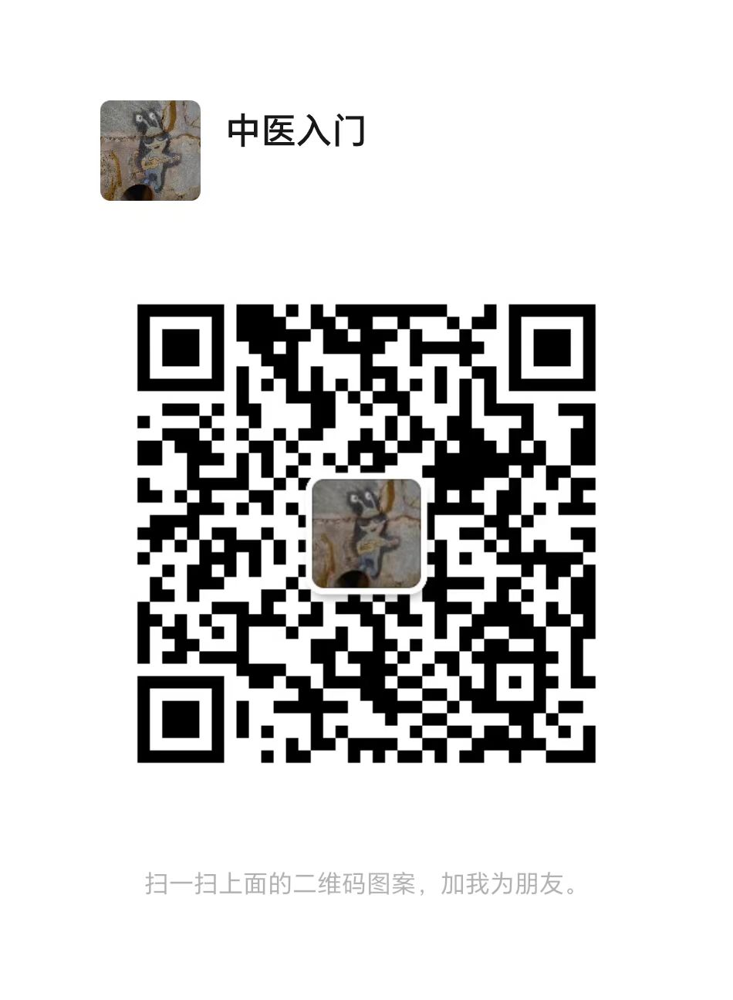

# 书评节选

这本书叫《中医概念入门》，其实学完之后不仅仅是了解了中医的一些概念，更重要的是通过这本书中形象例子，将这些抽象的概念串起来，在概念的基础上建立起了中医的基本理念。通过阅读这本书我才真正理解了“谨察阴阳所在而调之,以平为期”的含义。也许这本书的书名并不能概括这本书的全部内容。

李老师把中医里这些难懂、模糊、抽象的概念，写成一本书，让这些概念明确、具体、形象，把以前需要我们挖空脑袋去悟的东西，清晰地成体系地写出来了，我从内心就非常敬佩，觉得这个就是一件很大的实事，很有意义的事。

<b>--学员：doglovecat</b>

今天在公交上了看中医概念入门，一下明朗了许多，解开了很多不解。以前一直对一些虚实寒热把不准，除了一些明显的热寒虚实之外，有些病症错综复杂，但通过书里的描述，感觉顿悟明了。对虚虚实实有了非常明确的理解，对像虚则补之，实则泻之，虚实共存有了非常形象的理解。之前总是知或不知，总是很模糊。现在完全不一样了。

还有就是对疾病的部位有了非常明确的理解。我是医疗设备工程师。之前跟了上万台手术，但总是自己去理解，不敢确定病在皮肤、筋膜、腑、脏的哪一个阶段更重。书里有了明确的定义，这也是之前的书没有的。

<b>--读者：四逆汤</b>

学完李文强先生的《中医概念入门》，感觉此书是中医划时代的标志！从此，中医从玄学变为一门有逻辑的正式学科，以后普通人都能理解中医道理。

我以前学过其它入门书籍，比如《中医基础理论》、《圆运动的古中医》等等。这些书籍入门都不容易，主要是基本名词模糊，让人不懂，对问题的解释很牵强，像诡辩。

《入门》首先解决了阴阳定义的问题，在此基础上，对虚实、寒热、天人合一、证、诊、治等概念做出了清晰解释。中医各家学说都可以在其中找到自己的位置。理清了中医理论的很多难点，却通过生活常识使人非常容易理解，担得起“深入浅出”四个字。

以前中医总说“悟”，就是说不清道理，要通过大量学习，自己联想体会。过程艰难不说，每个人都能悟出点东西，都不全，就是盲人摸象。中医内部互相争吵。外人不敢学中医，太难。

《入门》的讲解过程应是经过深入思考的，由浅入深，每个概念都要说清楚，后面才会使用。这点与以前的中医书有明显不同。推荐给几个朋友，都说能看懂！还是理科生能把事说明白！

该书应该成为所有中医学习者的第一本入门书，可为学习者节省大量的学习时间，如能普及，真是利国利民的好事！

<b>--读者：中医小跑堂</b>

《中医概念入门》是基础中的基础，是入门的垫脚石，是决定中医学习程度与准确性的起点与坐标，非常重要。

   《中医概念入门》全书章节内容设置就很清晰。从整个天地阴阳讲起，用温室做比喻，引入"功能决定平衡点"，"平衡点决定阴阳属性“等概念，尤其是”平衡点确定后才能谈阴阳"这一条件，一下子令我茅塞顿开。作为一个中国人，生活中总是能听到、看到、遇到关于阴阳的各种说辞，中医中阴阳属性的划分尤其至关重要。对阴阳的正确认识，也是决定能否做一个明白人和名医的先决条件。虽然我只是个中医爱好者，也很下功夫的读过一些医书，比如《中医基础理论》等，书中对阴阳概念的解释，就是以概念解释概念，简单划分，枯燥难懂，遇到具体问题時还是似是而非，判断不清。所以，我觉得《中医概念入门》这本书真的很好，对学习中医打基础帮助很大，我会细心阅读，认真做笔记，体会、理解，建立正确理念。

<b>--读者：chengwencui258</b>

