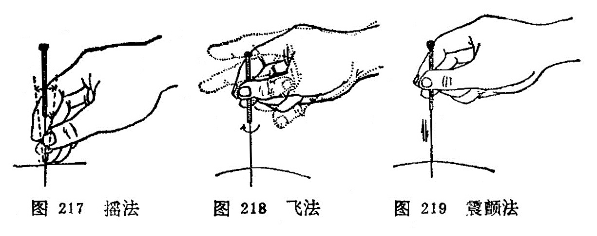

### 三、行针与得气

行针亦称运针，是指将针刺入腧穴后，为了使之得气，激发针感以及进行补泻而施行的各种针刺手法。得气又称针感，是指 针刺入穴位后所产生的经气感应。当这种经气感应产生时，患者 感到针下出现相应的痠、麻、胀、重感，或抽搐，有的也出现温 热、凉爽、烧灼、触电样感，在针刺的局部或从针下向远端放 散。医者则有针下沉紧、沉涩、沉重感觉，如同磁铁吸引针一样。 所以《标幽赋》说道：“气之至也，如鱼吞钩饵之沉浮”。又说
“沉涩紧而已至”。说明医者有沉紧、沉涩、沉重感觉，即是得气。起到疏通经气；调和气血的作用。如果针刺不得气，患者则没有什么感觉，而医者感到针下虚滑，如同针刺豆腐一样的感觉。《标幽赋》描写道：“轻滑慢而未来”，“气未至也，如闲处幽堂之 二深邃”。说明针与“经气”没有沟通。

从针刺治病和针刺麻醉以及经络感传研究的实践证明，针感 的有无及强弱，直接关系到治疗效果的好坏。因此，古今医家都 很重视针刺的得气，《灵枢•九针十二原》指出：“为刺之要，气至 而有效。效之信，若风之吹云，明乎若见苍天”，《金针赋》说： “气速至而效速，气迟至而不治”。这都说明得气与否，是治疗成 败的关键。一般来说，得气迅速，疗效就好；得气迟缓，疗效就差，如不得气，则可能无效。因此，在针刺过程中，如果得气较 慢，甚至不得气，就要分祈不禧气的原因。或因取穴定位不准确， 手法运用不当；或因针刺角度有误，深浅失度。对此就应重新调 整腧穴的钎刺部位、角度、深度，运用必要的针刺手法，这样再次行针时，一般即可得气。如果患者病久体虚，正气虚惫，以致 经气不足；或因其他病理因素，感觉迟钝、丧失而不易得气时， 可采用行针催气，或留针候气，或用温针，或加艾灸，以助经气 的来复，而促使得气，或因治疗而随着疾病转愈，而经气逐渐得 到恢复，针刺时则迅速得气。若用上法而仍不得气者，多为脏 腑经络之气虚衰已极。正如《针炎大成•经络迎随设为问答》中说：“只以得气为度，如此而终不至者，不可治也”。对此，当考虑配 合或改用其他治疗方法。	

现将临床常用的行针基本手法和辅助手法介绍如下：

（一）行针基本手法     行针基本手法，是针刺基本动作，常用的有提插法和捻转法两种。	

1.提插法：是将针刺入腧穴的一定深度后，使针在穴内进 上、下进退的操作方法。使针从浅层向下刺入深层为插；由深层向上退到浅层为提（图211)。提插的幅度大、频率快、操作时间长，则刺激量大；提插幅度小、频率慢，操作时间短,，则剌激 量小。应根据病人的体质、病情和腧穴的部位以及医者所要达到 的目的而灵活掌握。但不能提插幅度过大，使深部组织受损害， 以提插幅度3〜5分深为宜。

2.捻转法：是将针刺入腧穴的一定深度后，将针左右来回旋转捻动的操作方法（图212、213)。捻转的角度大，频率快， 操作时间长，则刺激量大；捻转的角度小，频率慢，操作时间短， 则刺激量小。应根据病人的体质、病情和腧穴的部位特征以及医者所要达到的目的而灵活运用。但捻转角度不要超过360°，更不能向一个方向捻转，即顺时针或逆时针捻转180°为宜。否则针身缠绕肌纤维而发生疼痛。

以上两种基本手法，既可单独使用，也可互相配合应用，在临床上必须根据病人的具体情況，灵活掌握，才能发挥其应有作用。

(二)行针辅助手法    是进行针刺时，用以辅助行针的操作方法。常用的有以下几种：	

1.循法：是以左手或右手于所针剌腧穴的周围或沿经脉的循行部位轻轾地循按的方法（图214)。此法在未得气时用之，可以通气活血，有行气、催气之功。

2.弹法：是将针刺入腧穴的一定深度后，以手指轻弹针柄，使针体微微震动，以加强针感（图215)。《针灸问对》说：“如气不行，将针轻轻弹之，使气速行，……故曰弹以催气“。

3.刮法：是将针刺入腧穴的一定深度后，用拇指或食指的指腹抵住针尾，以拇指、食指或中指爪甲，由上而上的频频刮动针柄的方法（图216)。此法在不得气时，用之可激发经气，促使得气或者加强针感和促使针感的扩散。

4.摇法：是将针入腧穴的一定深度后，手持针柄进行摇动，可以行气（图217)。若直立针身而摇，可以加强针感；卧倒 针身而摇，往往可以促使针感向一定方向传导。

5.飞法：是将针刺入腧穴的一定深度后，以捻转为主，一 般将针先作较大幅度的捻转，然后松手，拇、食指张开，一捻一 放，反复数次，如飞鸟展翅之状，可以使针感增强（图218)。 《医学入门》说：“以大指、次（食）指捻针，连搓三下，如手颤之状，谓之飞。”

6.震颤法：是将针刺入腧穴的一定深度后，右手以拇、食、 冲三指挟持针柄，用小幅度、快频率的提插捻转动作，使针身产 生轻微的震颤，以增强针感（图219)。

